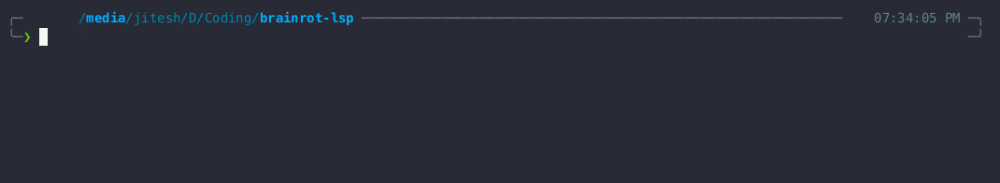

# 🤪 Brainrot LSP

A Language Server Protocol (LSP) implementation that brings social media slang and internet speak autocompletion to your editor. Express yourself in peak internet culture with predefined snippets and intelligent completions.



## ✨ Features

- 🚀 Smart autocompletion for social media slang and internet expressions
- 📝 Rich snippet templates for common social media formats
- 💅 Built-in templates for:
  - Story templates
  - Rant formats
  - Ratio responses
  - Chat-style reactions
  - Flex posts
  - Vibe checks
  - Tea spilling formats
  - Reviews
  - Slay reports
  - Viral challenges
  - Exposed threads
  - POV scenarios
  - Fit checks
  - Trend reviews
  - Arguments

## 🛠️ Installation

### Building from source

```bash
# Clone the repository
git clone https://github.com/Jitesh117/brainrot-lsp
cd brainrot-lsp

# Build the project
go build
```

## 📦 Editor Setup

### Neovim

Add to your config:

```lua
local function start_brainrot_lsp()
  local filetype = vim.bo.filetype
  if filetype == "text" or filetype == "markdown" then
    vim.lsp.start {
      name = "brainrot-lsp",
      cmd = { "path-to/brainrot-lsp" },
      root_dir = vim.fn.getcwd(),
    }
  end
end

vim.api.nvim_create_autocmd("BufEnter", {
  pattern = "*",
  callback = start_brainrot_lsp,
})

```

Or if you want to test it in your current nvim session, create a file called brainrot.lua. Then add the following:

```lua
vim.lsp.start({
	name = "brainrot-lsp",
	cmd = { "path-to/brainrot-lsp" },
	root_dir = vim.fn.getcwd(),
})

```

Save this file and then run the command `:source brainrot.lua`. Now you can access the lsp in your current neovim session. Enjoy!

### Other Editors

The LSP server supports any editor with LSP capabilities. Configure your editor to:

- Start the brainrot-lsp binary
- Connect via stdio (default), TCP, WebSocket, or Node.js IPC

## 🚀 Usage

Start typing to see contextual completions, or use these triggers:

- `story` - Generate dramatic story templates
- `rant` - Create passionate rants
- `ratio` - Generate Twitter-style ratio responses
- `reaction` - Create chat-style reaction scenes
- `flex` - Generate flexing/bragging templates
- `vibe` - Create vibe check statuses
- `pill` - Generate tea spilling templates
- `review` - Create review templates
- `slay` - Generate slay reports
- `challenge` - Create viral challenge templates
- `xposed` - Generate expose thread templates
- `pov` - Create POV scenarios
- `fit` - Generate fit check templates
- `trend` - Create trend review templates

## 🏗️ Architecture

Built using:

- [glsp](https://github.com/tliron/glsp) - Go LSP framework providing:
  - Message structures for LSP communication
  - Handler system for client methods
  - JSON-RPC 2.0 server supporting multiple transport protocols:
    - Standard I/O
    - TCP
    - WebSockets
    - Node.js IPC

## 🤝 Contributing

Contributions are welcome! Here's how you can help:

1. Fork the repository
2. Create your feature branch (`git checkout -b feature/AmazingFeature`)
3. Commit your changes (`git commit -m 'Add some AmazingFeature'`)
4. Push to the branch (`git push origin feature/AmazingFeature`)
5. Open a Pull Request

## 🙏 Acknowledgments

- [glsp](https://github.com/tliron/glsp) for the excellent LSP framework
- Internet culture for the inspiration

---

Built with 💀 by [Jitesh117](https://github.com/Jitesh117)
